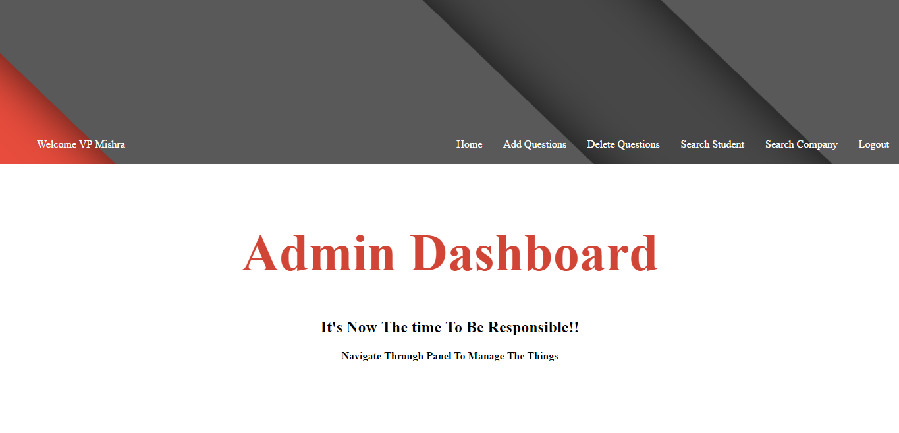

# Online-Evaluation-System
This is a website created using JSP technology in which users can create account and give objective exam in whichever programming languages they want.

# Functionalities in The Website
* Login , Registration Functionality for user
* Session Management
* Student Panel
* Admin Panel
* Company Panel
* Email Sending  Functionality
* Forgot Password Functionality
* Sending Feedback Functionality
* Downloading Report Functionality

# Technology used
* Java SE (Standard Edition)
* Java EE (Enterprise Edition)
* JSP (Java Server Pages)
* JDBC (Java Database Connectivity) (API)
* Apache Tomcat Server 9
* MySql Server 5.5
* HTML (Hypertext Markup Language)
* CSS (Cascading Style Sheets)
* JavaScript

# Modules Present In The Website
* Student Module
* Admin Module
* Company Module

# Screenshots

## HomePage

## Student Module 

## Admin Module 

## Company Module 

